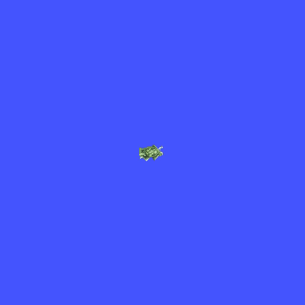

# Homework 2 README
Maintained by Sarah Ziselman for ME 495 Embedded Systems

## Overview
This package is composed of two parts: Turtle Trajectories and Xacro ARM.

## Part I: Turtle Trajectories
### Overview
This part of the package makes a turtlebot travel in a figure-8 trajectory either in simulation or in real life. It utilizes a python package `homework2` to calculate the trajectory and the corresponding `cmd_vel` commands. See `doc/kinematics.pdf` for PDF document containing the calculations used for the python package.

Nodes:
* `trajectory` - this node calculates the figure-8 trajectory and corresponding control commands to move the turtlebot.
* `simodom` - this node simulates the odometry of the turtlebot.

### Usage
The `figure_eight.launch` file launches the following nodes: `trajectory`, `simodom` `joint_state_publisher`, `robot_state_publisher`, and `rviz`. Use the following command to launch the nodes to command the trajectory in the `turtlesim_node` node.
```
roslaunch homework2 figure_eight.launch mode:=sim
```
Use the following command to launch the nodes to command the trajectory in real life.
```
roslaunch homework2 figure_eight.launch mode:=real
```
### Configuration
Once the `figure_eight.launch` file is launched, the turtle is in the paused state. In order to begin the figure-8 trajectory, open another terminal and use the following command:
```
rosservice call /resume
```
Use the following command to return the turtle to the paused state.
```
rosservice call /pause
```
Note that using the `pause` and `resume` service will not change the trajectory or reset the position of the turtle. The `turtlesim_node` will result in the following:



The turtle in `rviz` will result in the following:


Lastly, in `real` mode, the turtlebot will result in the following:


## Part II: Xacro ARM

### Overview
This part of the package contains a self-written Xacro URDF for a two link revolute joint arm. The robot arm is visualized in rviz and joint angles are calculated such that the end-effector follows a straight-line trajectory.
Nodes:
* `arm_traj` - this node calculates the trajectory of the robot arm end-effector and uses inverse kinematics to solve for the corresponding joint states, which get published to the `joint_state` topic.
* `arm_marker` - this node draws markers in `rviz` at the end-effector position. When x is positive, the marker will be a periwinkle sphere. When x is negative, the marker will be a lavender cube. This node publishes at 1/10th the frequency that the `arm_traj` node publishes at.

### Usage
The following command loads the `robot_state_publisher` node, the `joint_state_publisher_gui` node, and a configuration in Rviz that visualizes the robot arm.
```
roslaunch homework2 arm_basics.launch
```
Once launched, the following robot arm should appear in Rviz as seen in the photo below:


The following command loads all the nodes mentioned above in `arm_basics.launch`, the `arm_traj` node, and the `arm_marker` node. This launch file starts robot arm's trajectory and draws markers at the end-effector position.
```
roslaunch homework2 arm_marker.launch
```
Once launched, the robot arm should follow a straight-line trajectory at a constant y-value as seen in the gif below:
